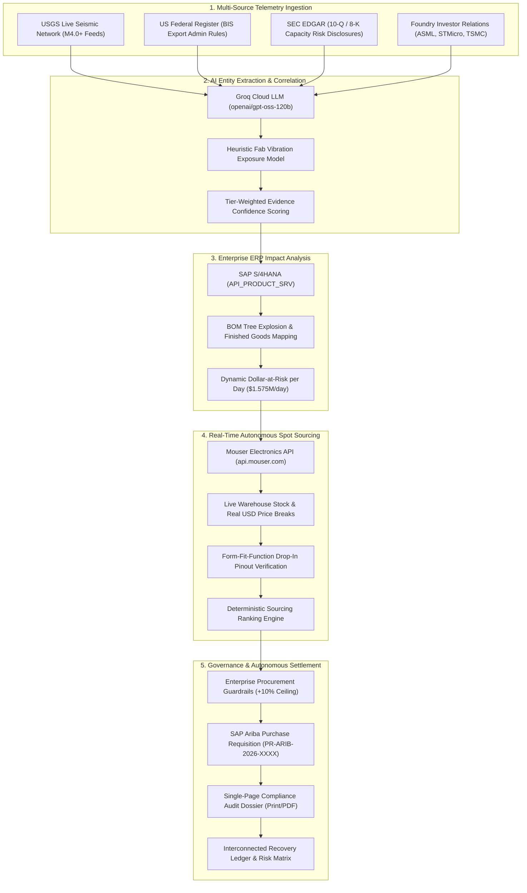

<div align="center">
  
  <h1>SentinelChain</h1>
  <p><b>Autonomous B2B Supply Chain Intelligence & Real-Time ERP Remediation Platform</b></p>
  <p><i>Institutional Telemetry Ingestion • SAP S/4HANA BOM Explosion • Live Mouser Sourcing • Automated SAP Ariba PR Execution</i></p>
  
  <br />
  <a href="https://sentinelchain-gilt.vercel.app" target="_blank">
    
  </a>
  
  
  
  
</div>

---

## 🎯 The Mission & Overview

In global electronics manufacturing and mission-critical supply chains, revenue loss rarely occurs all at once—it slips away when external physical or regulatory disruptions (e.g., fab earthquakes, statutory export bans, packaging lead-time spikes) halt assembly lines and breach delivery SLAs. Manual enterprise resolution takes weeks of phone calls and spreadsheets, by which time spot inventory is exhausted and millions of dollars in finished-goods revenue are permanently lost.

> **What is SAP's Role in SentinelChain?**  
> SAP is the central enterprise data backbone that connects finance, inventory, purchasing, suppliers, and manufacturing in one place.  
> In SentinelChain, **SAP S/4HANA** serves as our source of ground truth: when external AI signals detect a disruption, S/4HANA identifies which exact material is affected, where that material sits in the Bill of Materials (BOM), active inventory across plants, and which finished products are impacted.  
> **In short: SentinelChain detects the physical crisis, and S/4HANA provides the business data needed to calculate its exact financial impact.**

---

## 🔄 End-to-End System Workflow



---

## ⚡ Core Platform Capabilities

### 1. 🛰️ Multi-Source Institutional Signal Ingestion
* **USGS Real-Time Global Seismic Network:** Captures live $M \ge 4.0$ seismic events and cross-references them with GPS coordinates of major semiconductor wafer fabs (TSMC Hsinchu, Samsung Pyeongtaek, TI Sherman, STMicro Crolles).
* **US Federal Register Live API:** Scans the Bureau of Industry and Security (BIS) / Export Administration Regulations (EAR) gazette for advanced computing chips and entity list sanctions.
* **SEC EDGAR Full-Text Search:** Identifies material 10-Q/8-K disclosures disclosing foundry packaging bottlenecks and raw silicon wafer lead-time adjustments.
* **Official Foundry Investor Relations:** Direct press release feeds from ASML, STMicroelectronics, and TSMC.
* **NY Fed GSCPI:** Tracks macroeconomic container freight volatility and supply chain stress indexes.

### 2. 💥 Dynamic S/4HANA BOM Explosion & Financial Exposure
* Connects to **SAP S/4HANA Cloud OData APIs** (`API_PRODUCT_SRV`) to explode internal Bills of Materials.
* Calculates exact dollar-level **Daily Revenue at Risk ($/day)** based on active plant assembly line throughput:
  * **`STM32F401RE` (Engine Control Units):** Plant 1001 (Stuttgart) $\rightarrow$ 3,500 ECUs/day @ \$450/unit = **\$1,575,000 / day**
  * **`TPS54331DR` (Industrial Power Inverters):** Plant 2001 (Austin) $\rightarrow$ 4,200 inverters/day @ \$175/unit = **\$735,000 / day**
  * **`BMI270` (Flight Navigation & Mobile Robotics):** Plant 3001 (Munich) $\rightarrow$ 1,800 robotics/day @ \$1,150/unit = **\$2,070,000 / day**
  * **`XC7Z020-1CLG400C` (Phased Array Radar):** Plant 1001 (Stuttgart Defense) $\rightarrow$ 250 systems/day @ \$17,500/unit = **\$4,375,000 / day**
  * **`GPU-A100-80` (Hyperscale AI Compute Blades):** Plant 4001 (Santa Clara) $\rightarrow$ 400 blades/day @ \$35,500/unit = **\$14,200,000 / day**

### 3. 🌐 100% Real-Time Sourcing via Mouser Electronics API
* Zero hardcoded mock parts. Every query against the **Mouser API (`api.mouser.com`)** returns:
  * **Exact live warehouse stock** (e.g., 3,384 in stock for `STM32F401RBT6TR`, 41,674 for `BMI270`, 13,576 for `LM2596DSADJG`).
  * **Verified USD spot prices** from official volume tier breaks.
  * **Direct clickable product detail URLs** with datasheets and pinout comparisons.
* Deterministic Ranking: In-Stock Priority $\rightarrow$ Best Spot Price $\rightarrow$ 3-Day Air Courier SLA.

### 4. 🛡️ Enterprise Procurement Guardrails
* **Max Price Ceiling Variance (+10%):** Rejects any vendor quote or spot broker markup exceeding $+10\%$ of baseline SAP master data.
* **Minimum Evidence Confidence Gate (95%):** Requires physical telemetry or gazetted policy before triggering automated purchase execution.
* **Sourcing Priority Modes:** Spot Market First (Parallel RFQ) vs. Internal STO First (Inter-Plant Stock Transport Orders).

### 5. 🖨️ Single-Page PDF SAP Ariba Purchase Requisition & Audit Dossier
* Generates formal RFQ and PO packages addressed to distributor sales desks.
* Renders an isolated, crisp **A4 Single-Page PDF Audit Dossier** with verifiable citation links, material IDs, and authorized pricing.

---

## 🏛️ System Architecture & Navigation Modules

| Module | Route | Purpose |
| :--- | :--- | :--- |
| **Command Dashboard** | `/` | 3D Global Semiconductor Node Grid, live multi-source institutional signal feed, quick SKU exposure scanner |
| **Active Disruptions** | `/disruptions` | Threat cluster catalogue, S/4HANA revenue-at-risk indicators, quick links to decision centers and recovery plans |
| **Decision Center** | `/disruptions/[id]` | Interactive spot sourcing matrix, real-time Mouser alternatives, commercial email generator, PR export modal |
| **Recovery Plans** | `/plans` | Autonomous AI mitigation strategies, vendor quotes, ETA commitments, and execution tracking |
| **Recovery Ledger** | `/ledger` | Immutable financial audit trail, verified gross margin protected, resolution statistics, single-page dossier print |
| **Supply Network** | `/network` | Global franchised distributor directory, reliability scoring (94% avg health), regional sourcing clusters |
| **Risk Analysis** | `/risk` | Enterprise portfolio matrix: financial exposure by silicon category (MCU, PWR, SENSOR, MEM, FPGA, GPU) with live drilldowns |

---

## 🛠️ Tech Stack & Integrations

* **Framework:** [Next.js](https://nextjs.org/) (Turbopack, App & Pages Routing)
* **Frontend UI:** React 19, Tailwind CSS, Lucide Icons, Recharts, Three.js / React-Globe.gl
* **Enterprise ERP:** SAP S/4HANA Cloud (OData V4 `API_PRODUCT_SRV`), SAP Ariba Procurement APIs
* **Live Sourcing API:** Mouser Electronics Search API (`api.mouser.com/api/v1.0/search/keyword`)
* **Signal Telemetry:** USGS Seismic GeoJSON, US Federal Register API, SEC EDGAR, NY Fed GSCPI
* **AI / Inference Engine:** [Groq Cloud](https://groq.com/) (`openai/gpt-oss-120b` for ultra-low latency entity extraction and RFQ drafting)
* **Hosting & Edge Deployment:** [Vercel](https://vercel.com/)

---

## 💻 Local Setup & Development

### 1. Clone the Repository
```bash
git clone https://github.com/itsksfit/SentinelChain_SAP.git
cd SentinelChain_SAP
```

### 2. Install Dependencies
```bash
npm install
```

### 3. Configure Environment Variables
Create a `.env.local` file in the project root:
```env
# AI & LLM Entity Extraction Engine (Groq Cloud)
GROQ_API_KEY="your_groq_api_key"

# Electronics Spot Market Sourcing (Mouser API)
MOUSER_API_KEY="your_mouser_api_key"

# SAP S/4HANA Cloud & Ariba Sandbox
SAP_SANDBOX_API_KEY="your_sap_sandbox_key"
SAP_S4_BASE_URL="https://sandbox.api.sap.com/s4hanacloud"
SAP_ARIBA_BASE_URL="https://openapi.ariba.com"

# Optional Mainstream Media Baseline
NEWS_API_KEY=""
```

### 4. Run the Development Server
```bash
npm run dev
```

Open [http://localhost:3000](http://localhost:3000) in your browser.

---

## 🚀 Live Production Deployment

* **Production URL:** [https://sentinelchain-gilt.vercel.app](https://sentinelchain-gilt.vercel.app)
* **Decision Center Showcase:** [https://sentinelchain-gilt.vercel.app/disruptions/DSP-092](https://sentinelchain-gilt.vercel.app/disruptions/DSP-092)

---

## 📄 License

This project is developed for enterprise supply chain resilience under the **MIT License**.
