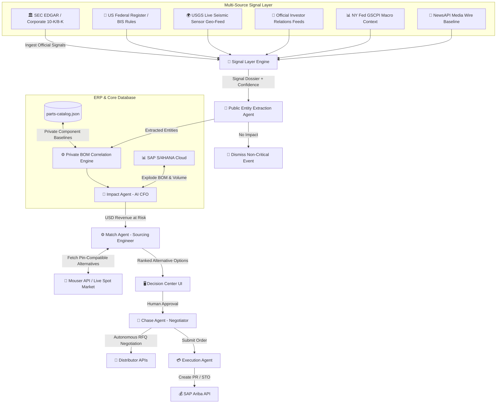

# 🛡️ SentinelChain Project Analysis

SentinelChain is an AI-powered enterprise pipeline designed to transform supply chain risk management from a manual, reactive process into an autonomous, self-healing workflow. Specifically tailored for the **Global Semiconductor Industry**, the platform bridges the gap between real-world macroeconomic disruptions (live news) and enterprise ERP systems (SAP S/4HANA & SAP Ariba) to automate mitigation, alternative component engineering, and purchase requisitioning.

---

## 🎯 Project Vision & Goals

The core vision of **SentinelChain** is to create an **autonomous, self-healing supply chain**. 

In the high-stakes global semiconductor industry, time is money. A factory fire, a shipping strike, or regulatory export restrictions can freeze production lines, leading to millions of dollars in losses. SentinelChain aims to:
* **Minimize Latency:** Reduce recovery time from weeks of manual coordination to under two minutes of AI-driven analysis, negotiation, and execution.
* **Remove Human Bottlenecks:** Automate detection, financial impact calculation, matching pin-compatible components, and price negotiation, while retaining a **Human-in-the-Loop** model for approval.
* **Integrate Seamlessly:** Act as the intelligence layer sitting directly on top of SAP S/4HANA (data center) and SAP Ariba (procurement center).

---

## 🚀 The Problem Statement

Traditional procurement teams struggle with supply chain disruptions due to:
1. **Siloed Systems:** News is tracked via feeds, component specs via engineering databases, inventory via ERPs, and buying via procurement desks. Connecting these dots takes days.
2. **Slow Response Times:** In a semiconductor shortage, global distributor inventories (Digi-Key, Mouser) sell out in hours. Traditional manual RFQ processes are too slow, allowing competitors to buy out available stocks.
3. **Complex Impact Assessment:** Quantifying how a yield drop at a specific TSMC fab affects an end product (e.g., an AI Server) and calculating the daily USD revenue-at-risk requires deep BOM cross-referencing that is rarely automated.

---

---

## 🏗️ System Architecture

SentinelChain's architecture comprises three core pillars: **Multi-Source Signal Layer (Ingestion)**, **Public Entity Extraction & Private BOM Correlation (Decision)**, and **ERP/Marketplace Integration (Execution)**.

### 1. Multi-Source Signal Ingestion Layer
* **Signal Layer Engine:** Located in [`lib/intelligence/signalLayer.js`](file:///Users/sushilkohli/Downloads/untitled%20folder/SentinelChain_SAP/lib/intelligence/signalLayer.js), it synthesizes live verifiable primary sources:
  - **Corporate Disclosure Adapter:** Direct live queries to **SEC EDGAR** for U.S.-reporting semiconductor companies/ADRs and **Official IR Disclosures** for non-U.S. foundries (ASML, STMicro).
  - **Geophysical Hazard Adapter:** Live **USGS Seismic Geo-Feed** cross-referenced against the Global Semiconductor Fab Registry using the *Heuristic Fab Vibration Exposure Model*.
  - **Trade Policy Adapter:** Live **US Federal Register API** for BIS Entity List rules.
  - **Macro Context:** **NY Fed GSCPI** background indicator.
  - **Mainstream Media Baseline:** **NewsAPI** used for public media reporting context.

### 2. Multi-Agent AI & Deterministic Correlation Framework
* **Entity Extraction Agent:** Located in [`pages/api/detect.js`](file:///Users/sushilkohli/Downloads/untitled%20folder/SentinelChain_SAP/pages/api/detect.js). It takes incoming public signal text and extracts the affected public companies, technology categories, and incident severity.
* **Private Deterministic BOM Correlator:** Maps public entity extractions directly to the private enterprise Bill of Materials (BOM) in `parts-catalog.json`. Computes a deterministic **Evidence Confidence** score based on verified source tiers.
* **Impact Agent:** Located in [`pages/api/impact.js`](file:///Users/sushilkohli/Downloads/untitled%20folder/SentinelChain_SAP/pages/api/impact.js). It extracts BOM dependencies and calculates the daily dollar volume at risk ($Daily\ Risk = Component\ Base\ Price \times Daily\ Volume$).
* **Match Agent:** Found in [`pages/api/match.js`](file:///Users/sushilkohli/Downloads/untitled%20folder/SentinelChain_SAP/pages/api/match.js). It pulls pre-mapped alternatives from [`parts-catalog.json`](file:///Users/sushilkohli/Downloads/untitled%20folder/SentinelChain_SAP/data/parts-catalog.json) and queries the **Mouser Search API** for live spot market inventory, pricing, and ETAs.
* **Chase Agent:** Implemented in [`pages/api/negotiate.js`](file:///Users/sushilkohli/Downloads/untitled%20folder/SentinelChain_SAP/pages/api/negotiate.js). It acts as an automated procurement officer that bargains with distributor endpoints (or simulates conversations in demo mode) to obtain discounts, checking results against a strict **15% price ceiling variance**.

### 3. ERP Integration
* **SAP S/4HANA (The "Brain"):** Interfaces via [`s4hana.js`](file:///Users/sushilkohli/Downloads/untitled%20folder/SentinelChain_SAP/lib/sap/s4hana.js) to retrieve official enterprise inventory structures, BOM relations, and product mappings.
* **SAP Ariba (The "Wallet"):** Interfaces via [`ariba.js`](file:///Users/sushilkohli/Downloads/untitled%20folder/SentinelChain_SAP/lib/sap/ariba.js) to generate and submit Purchase Requisitions (PR) automatically upon plan approval.

---

## 🔄 System Flow & Execution Lifecycle

The platform runs a clear, six-stage pipeline that transitions from a physical disruption to ERP resolution:

### 1. Detection
* **Trigger:** Live news stories are updated every 30 seconds.
* **Action:** The user triggers **Analyze Impact**. The system invokes `pages/api/detect.js`.
* **Output:** Determines if the event is a valid disruption. If irrelevant (e.g., a general logistics delay that doesn't block silicon supply), it halts the pipeline, documenting it as a dismissed event in the local storage vault.

### 2. Impact Assessment
* **Trigger:** Detection Agent flags a true disruption.
* **Action:** The system fetches material BOM records from SAP S/4HANA via `getMaterial()` and maps them to active products.
* **Output:** Computes the total daily revenue exposure (e.g., $1.5M/day for A100 GPU shortages) and updates the dashboard.

### 3. Alternative Sourcing (Match)
* **Trigger:** Impact Agent quantifies exposure.
* **Action:** The Match Agent queries Mouser API or falls back to `parts-catalog.json` for pin-compatible alternatives.
* **Output:** A list of alternative parts with real-time stock levels, lead times, and unit prices.

### 4. Human-in-the-Loop Review (Decision Center)
* **Trigger:** Sourcing alternatives are ready.
* **Action:** The UI displays a **"Decision Required"** prompt, letting the user open the **Decision Center** (`/disruptions/[id]`). Here, the user is presented with three strategy options:
  * **Option A:** External Procurement (Initiates parallel RFQ & Chase Agent negotiation).
  * **Option B:** Internal Reallocation (Reroutes internal inventory via Stock Transport Orders).
  * **Option C:** Do Nothing (Absorbs the risk and monitors status).

### 5. Supplier Negotiation (Chase)
* **Trigger:** User approves Option A (External Procurement).
* **Action:** The Chase Agent executes negotiation loops (up to 4 rounds) with the vendors. It attempts to secure discounts based on volume.
* **Rule Engine Check:** If the agreed-upon price is below the 15% price ceiling variance, it auto-generates the purchase details. If it exceeds the ceiling, it flags the transaction as `Escalated` for manual procurement override.

### 6. Transaction Execution
* **Trigger:** Negotiation finishes or STO is triggered.
* **Action:** Pushes the requisition payload to `pages/api/sap/recovery-plan.js` which triggers `ariba.js` to create the Purchase Requisition in SAP Ariba.
* **Ledger Update:** The resolution details (money saved, days recovered, vendor, and full multi-agent chat logs) are written to the local audit ledger (`data/disruption-batch.json` and client-side `localStorage`), which updates the **Recovery Ledger** (`/ledger`) and **Recovery Plans** (`/plans`) pages.

---

## 🎨 Frontend & Design Aesthetics

The user interface is built as a dark/light responsive Dashboard utilizing glassmorphic components, rich layouts, and visual aids:
1. **Interactive 3D Supply Network:** Powered by `react-globe.gl` and `Three.js` (located in [`WorldMap.jsx`](file:///Users/sushilkohli/Downloads/untitled%20folder/SentinelChain_SAP/components/WorldMap.jsx)). It visualizes global silicon nodes (TSMC in Hsinchu, ASML in Eindhoven, Intel in Santa Clara) with pulsing node rings and animated connection lines, changing color (red/cyan/green) to reflect supply line status.
2. **Decision Center UI:** Houses the interactive node graph detailing how a supplier disruption cascades down through the part, affected production plants, products, and finally revenue impact.
3. **Negotiation Chat Window:** A terminal-style chat interface displaying live rounds of negotiation between the Chase Agent and distributor agents, complete with typing animations.
4. **Analytics & Recovery Ledger:** Employs `recharts` to render a clean, color-coded donut chart showing outcome metrics (Mitigated Value, Active Threats, and Recovery Rate percentages).

---

## 📁 Key File Map

| Path | Purpose |
| :--- | :--- |
| [`pages/index.js`](file:///Users/sushilkohli/Downloads/untitled%20folder/SentinelChain_SAP/pages/index.js) | Main landing page & pipeline simulation orchestrator. |
| [`pages/disruptions/[id].js`](file:///Users/sushilkohli/Downloads/untitled%20folder/SentinelChain_SAP/pages/disruptions/%5Bid%5D.js) | Decision center with the visual impact graph, action matrix, and negotiation stream. |
| [`pages/ledger.js`](file:///Users/sushilkohli/Downloads/untitled%20folder/SentinelChain_SAP/pages/ledger.js) | Audit ledger displaying past resolved disruptions, money saved, and agent actions. |
| [`pages/plans.js`](file:///Users/sushilkohli/Downloads/untitled%20folder/SentinelChain_SAP/pages/plans.js) | Track executed mitigation plans or generate custom mock plans via manual prompts. |
| [`pages/risk.js`](file:///Users/sushilkohli/Downloads/untitled%20folder/SentinelChain_SAP/pages/risk.js) | Displays aggregated enterprise financial exposure split by product categories (GPU, MCU, etc.). |
| [`pages/network.js`](file:///Users/sushilkohli/Downloads/untitled%20folder/SentinelChain_SAP/pages/network.js) | Lists authorized vendor directory, reliability metrics, and active region mapping. |
| [`pages/api/detect.js`](file:///Users/sushilkohli/Downloads/untitled%20folder/SentinelChain_SAP/pages/api/detect.js) | Invokes Groq LLM API to filter and structure disruption classifications in JSON format. |
| [`pages/api/negotiate.js`](file:///Users/sushilkohli/Downloads/untitled%20folder/SentinelChain_SAP/pages/api/negotiate.js) | Implements multi-round supplier negotiation logic and ceiling rules. |
| [`lib/sap/s4hana.js`](file:///Users/sushilkohli/Downloads/untitled%20folder/SentinelChain_SAP/lib/sap/s4hana.js) | Connects to SAP S/4HANA `API_PRODUCT_SRV` services to retrieve live component dependencies. |
| [`lib/sap/ariba.js`](file:///Users/sushilkohli/Downloads/untitled%20folder/SentinelChain_SAP/lib/sap/ariba.js) | Submits Purchase Requisitions directly to the SAP Ariba sourcing system. |
| [`lib/intelligence/newsClient.js`](file:///Users/sushilkohli/Downloads/untitled%20folder/SentinelChain_SAP/lib/intelligence/newsClient.js) | Consumes, filters, and prioritizes live RSS news streams using NewsAPI. |
